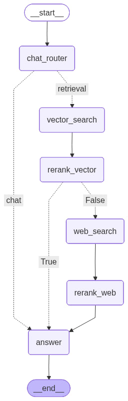

# DocGraph

**DocGraph** — проект по оценке релевантности документов к запросам и построению графовой структуры документов для поиска и анализа.

[Посмотреть пример работы графа (видео на Google Диске)](https://drive.google.com/drive/folders/1LE3-t_APSvpjKERk8v78IgYgDutWp9lX?hl=ru)

## Структура графа документов




---

## Что сделано в проекте

1. **Обучение классификатора на готовых данных**  
   - Использовался набор данных проекта DLS МФТИ.  
   - Обучен CatBoost-классификатор для оценки релевантности документа к запросу.  
   - Подобран оптимальный порог вероятности для бинарной классификации (релевантен / нерелевантен).

2. **Сбор и разметка собственного датасета**  
   - Собраны запросы и результаты веб-поиска.  
   - Документы размечены по релевантности к запросам.  
   - Классификатор настроен и откалиброван под этот датасет, выбран оптимальный порог для точной классификации.

3. **Построение графа документов**  
   - На основе результатов классификации создан граф документов:  
     - Узлы — документы  
     - Рёбра — связь между документами по смысловой близости и релевантности.  
   - Граф позволяет быстро искать релевантные документы и анализировать их структуру.

4. **Векторные представления и быстрый поиск**  
   - Для ускоренного поиска документы представлены в виде эмбеддингов.  
   - Использован FAISS для хранения векторных индексов и поиска похожих документов.

5. **Эксперименты и ноутбуки**  
   - Все эксперименты зафиксированы в Jupyter ноутбуках и PDF:  
     - `agent_.pdf` — разработка агента, end-to-end тестирование.  
     - `classifier.pdf` — обучение и настройка классификатора релевантности.  
     - `web_colibrovka.pdf` — сбор веб-данных, разметка и калибровка классификатора.

---

## Структура проекта

```
DocGraph/
├── backend/       # API и логика backend
├── frontend/      # Веб-интерфейс
├── Notebooks/     # PDF версий ноутбуков с экспериментами
├── src/           # Основной код: классификаторы, граф, эмбеддинги, LLM, векторная база
├── requirements.txt
└── README.md
```

---

Проект демонстрирует интеграцию **обученного классификатора, графовой структуры и векторного поиска** для анализа документов и быстрого поиска релевантных ответов.
